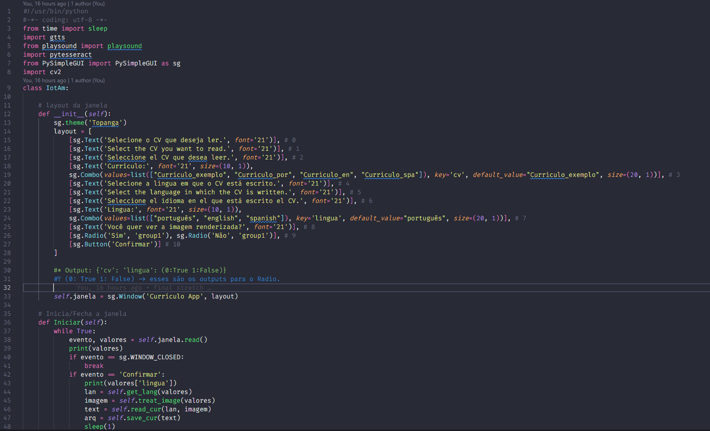
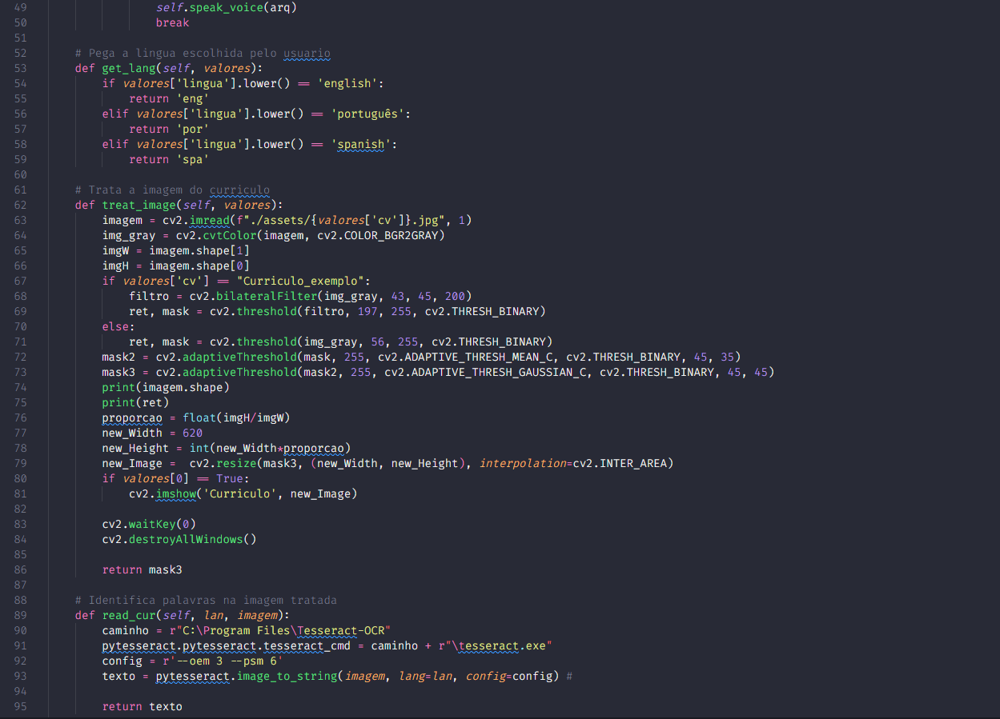
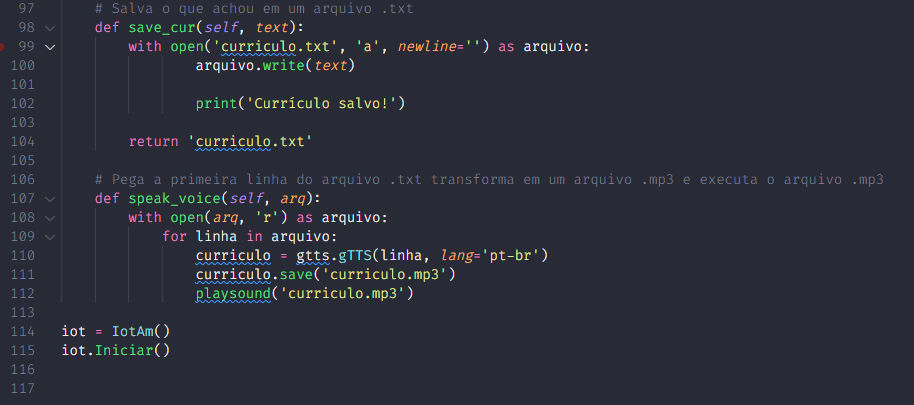
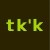

# Parte 1

| **Alunos**                           | **RMs**   |
|                 :---:                |   :---:   |
|**Carlos Eduardo de Castro Henriques**| **81945** |

**Turma: A**

**Ano: 4 SI**

## Objetivo / descrição do Projeto
Pegamos um currículo, o programa deve ler o currículo, fazer o tratamento de imagem, capturar o que foi lido e salvar em um arquivo _.txt_, além de transformar a primeira linha do currículo em um arquivo _.mp3_ e tocar o arquivo _.mp3_ para que possamos ouvir o nome do(a) dono(a) do currículo. 
## Diagrama do projeto

### Arquitetura

### Imagem utilizada

## Como usar 

Execute o app:

* Instale o Python versão 3
* Execute o seguinte comando no terminal para instalar a biblioteca do _PySimpleGUI_ 

|           Shell          |        Linux / Mac        |
|           :---:          |            :---:          |
| `pip install pysimplegui`|`pip3 install pysimplegui` |

* Execute o mesmo comando para `opencv-python`, `playsound`, `gtts` e `pytesseract` 
* Acesse o local do arquivo pelo terminal
* Abra o _app.py_ 
* Execute o comando `python app.py` no terminal
* Siga as instruções do aplicativo
* Pronto > Você acaba de executar o aplicativo de leitura e identifacação de currículos 😄

Como clonar o repositório:

~~~wsl2   
    cd /home/iot
    git clone https://github.com/Carlos-CECH/pythonNAC2
    cd iotAM
    ls
~~~
## Vídeo demonstrativo

## Referências 

* [Basic writing and formatting syntax](https://docs.github.com/en/github/writing-on-github/getting-started-with-writing-and-formatting-on-github/basic-writing-and-formatting-syntax)
* [PySimpleGUI](https://pysimplegui.readthedocs.io/en/latest/)
* [OpenCV - Contour Features](https://docs.opencv.org/4.x/dd/d49/tutorial_py_contour_features.html)
* [gTTS](https://gtts.readthedocs.io/en/latest/module.html#languages-gtts-lang)
* [PlaySound](https://pypi.org/project/playsound/)
* [Tesseract](https://github.com/UB-Mannheim/tesseract/wiki)

---
 __**[ Takaka ]**__ 

# Parte 2

| **Alunos**                           | **RMs**   |
|                 :---:                |   :---:   |
|**Carlos Eduardo de Castro Henriques**| **81945** |
|**Ian Makdisse**                      | **82205** |

**Turma: A**

**Ano: 4 SI**

## Objetivo / descrição do Projeto
Pegamos um currículo, o programa deve ler o currículo, fazer o tratamento de imagem, capturar o que foi lido e salvar em um arquivo _.txt_, além de transformar a primeira linha do currículo em um arquivo _.mp3_ e tocar o arquivo _.mp3_ para que possamos ouvir o nome do(a) dono(a) do currículo. 
## Diagrama do projeto

### Arquitetura

### Imagem utilizada

## Como usar 

Execute o app:

* Instale o Python versão 3
* Execute o seguinte comando no terminal para instalar a biblioteca do _PySimpleGUI_ 

|           Shell          |        Linux / Mac        |
|           :---:          |            :---:          |
| `pip install pysimplegui`|`pip3 install pysimplegui` |

* Execute o mesmo comando para `opencv-python`, `playsound`, `gtts` e `pytesseract` 
* Acesse o local do arquivo pelo terminal
* Abra o _app.py_ 
* Execute o comando `python app.py` no terminal
* Siga as instruções do aplicativo
* Pronto > Você acaba de executar o aplicativo de leitura e identifacação de currículos 😄

Como clonar o repositório:

~~~wsl2   
    cd /home/iot
    git clone https://github.com/Carlos-CECH/pythonNAC2
    cd iotAM
    ls
~~~
## Vídeo demonstrativo

## Referências 

* [Basic writing and formatting syntax](https://docs.github.com/en/github/writing-on-github/getting-started-with-writing-and-formatting-on-github/basic-writing-and-formatting-syntax)
* [PySimpleGUI](https://pysimplegui.readthedocs.io/en/latest/)
* [OpenCV - Contour Features](https://docs.opencv.org/4.x/dd/d49/tutorial_py_contour_features.html)
* [gTTS](https://gtts.readthedocs.io/en/latest/module.html#languages-gtts-lang)
* [PlaySound](https://pypi.org/project/playsound/)
* [Tesseract](https://github.com/UB-Mannheim/tesseract/wiki)

---
 __**[ Takaka ]**__ 
